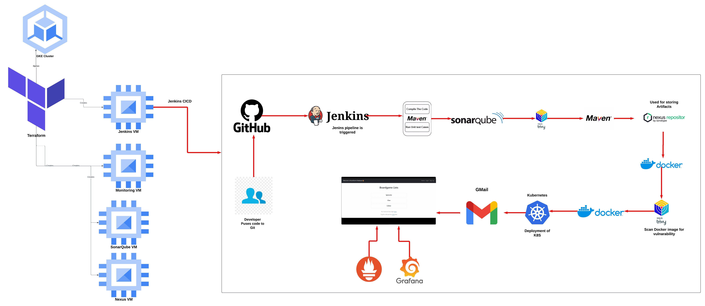
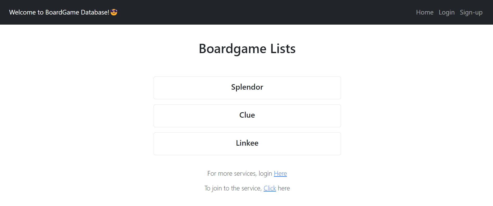

# Jenkins Project: Automated CI/CD Pipeline and Monitoring on Google Cloud with Terraform 🌐

## Architecture

  

## Situation
I was tasked with setting up a robust, automated CI/CD pipeline and monitoring system for our BoardGame application deployment, leveraging Google Cloud services and Terraform for infrastructure management.

## Task
The goal was to deploy essential DevOps tools like Jenkins, SonarQube, Nexus, and a monitoring stack (Prometheus & Grafana) across multiple VMs. Additionally, I needed to set up a Kubernetes (GKE) cluster for our application deployment, ensuring the entire pipeline was automated and monitored effectively.

## Action
- Deployed four VMs using Terraform, each dedicated to Jenkins, SonarQube, Nexus, and monitoring tools (Prometheus & Grafana).
- Installed Jenkins and other necessary tools on the VMs using startup scripts for seamless setup.
- Set up a GKE cluster with 2 nodes using Terraform, where our application would be deployed.
- Configured Jenkins with a multi-stage pipeline, including Maven compile and unit tests, SonarQube scan, Trivy code scan, Maven build, Nexus repository management, Docker image build, Trivy image scan, Docker image push, and deployment on Kubernetes.
- Integrated email notifications within Jenkins to alert the team on the success or failure of the build pipeline.
- Deployed monitoring using Prometheus and Grafana to oversee the health of both the application and Jenkins server.

## Result
  

Achieved a fully automated, end-to-end CI/CD pipeline with comprehensive monitoring, ensuring smooth and reliable application deployment. The infrastructure, managed entirely through Terraform, is now scalable, consistent, and easy to replicate. Monitoring and alerting systems are in place, providing real-time insights into application and server health, ensuring quick response times to any issues.

## Tags
#DevOps #Terraform #GoogleCloud #Kubernetes #CI_CD #CloudInfrastructure #Automation #Monitoring #Jenkins #Prometheus #Grafana #K8s #CloudNative #InfrastructureAsCode
